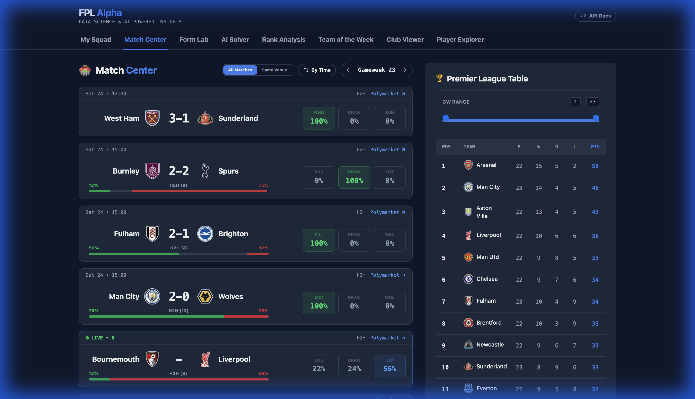
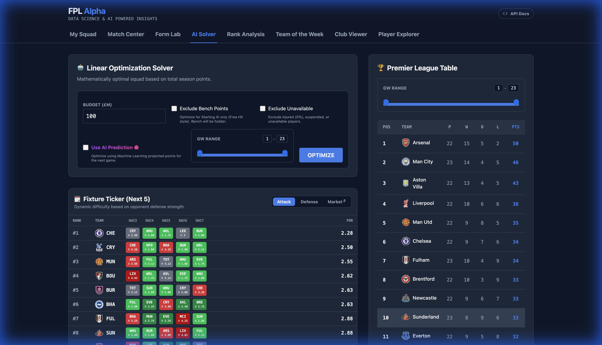
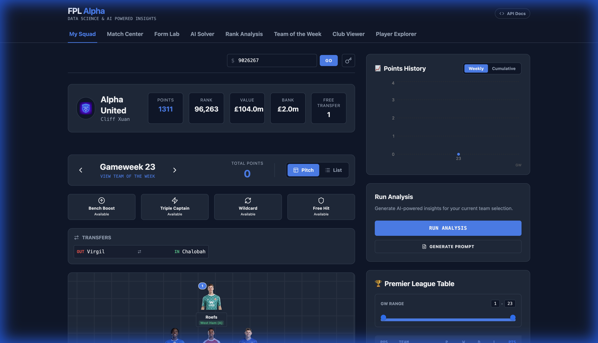
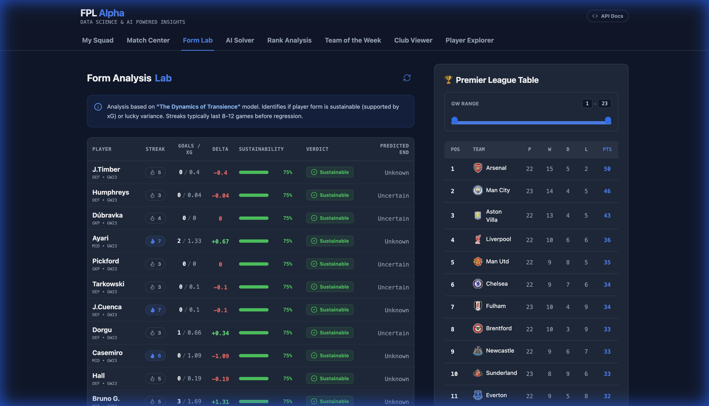
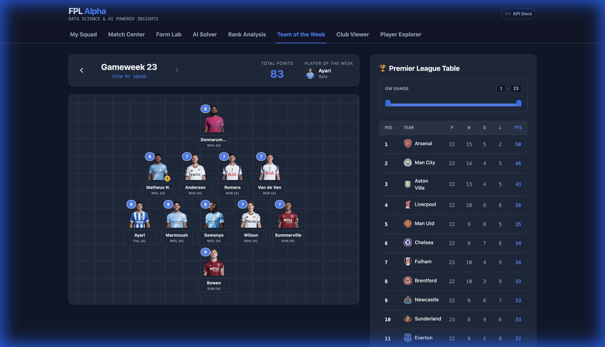
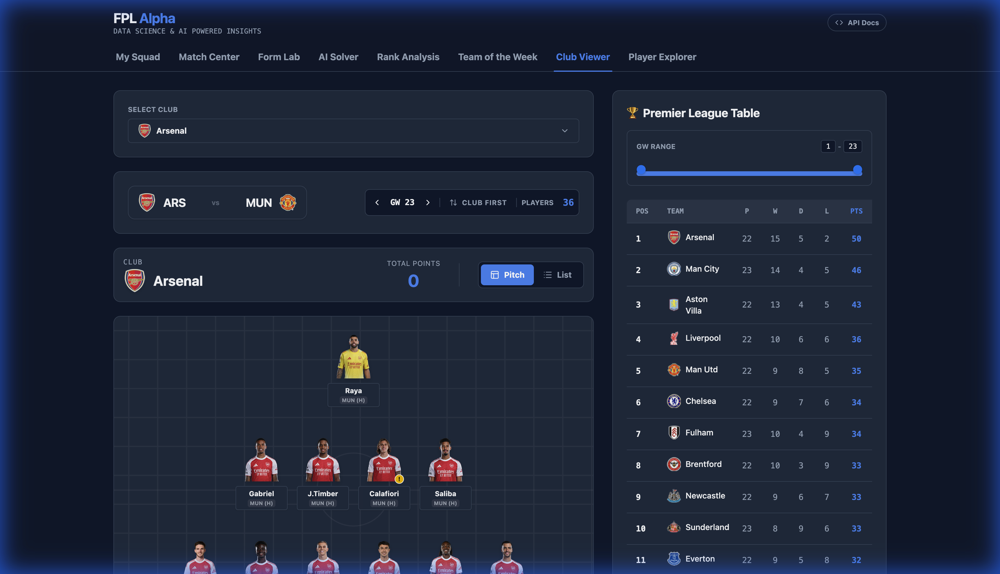
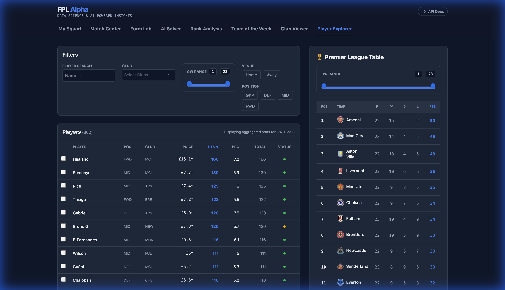
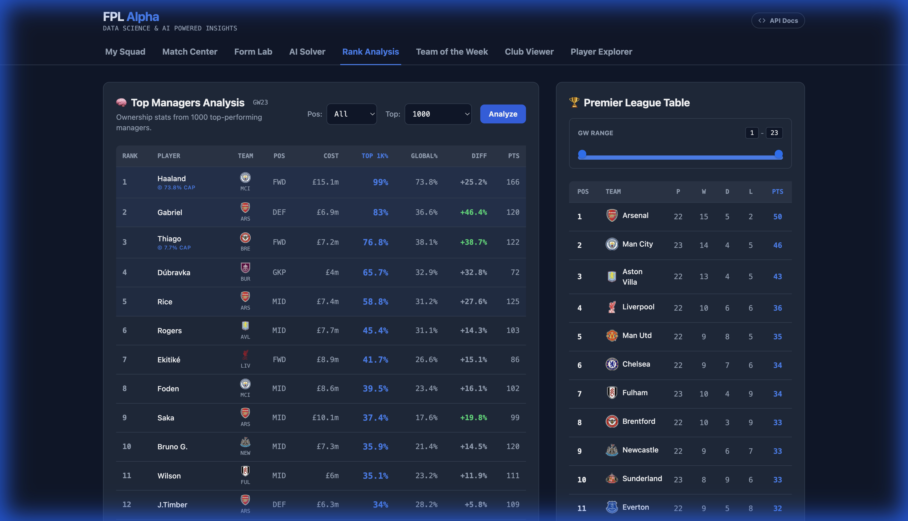

# FPL Alpha

**Data Science & AI Powered Insights for Fantasy Premier League**

FPL Alpha is a comprehensive companion application for Fantasy Premier League managers, leveraging advanced data analysis, machine learning, and linear programming to provide actionable insights and optimal strategies.



## Features

### 🚀 AI Solver
Generate the mathematically optimal team for any gameweek or planning horizon using linear programming. Customize constraints and objectives to find the best possible lineup.



### 📊 My Squad Analysis
Deep dive into your own team's performance. Track points history, analyze transfer effectiveness, and get AI-powered recommendations for your next moves.



### 📈 Form Analysis Lab
Visualize player form trends over time. Compare players and identify rising assets before they become bandwagons.



### 🏆 Team of the Week
View the optimal team for the current gameweek based on actual performance or projected points.



### 🏢 Club Viewer
Detailed breakdown of every Premier League club. Analyze fixtures, squad depth, and player statistics for any specific team.



### 🔍 Player Explorer
Advanced search and filtering tools to find the perfect differential or replacement. Filter by position, price, team, and underlying stats.



### 📉 Rank Analysis
Analyze the strategies of top-ranked managers. See template teams, effective ownership, and chip usage trends among the elite.



## Installation & Setup

### Prerequisites
- **Python 3.12+** (Recommended to use `uv` for dependency management)
- **Node.js 20+**

### Backend Setup

1.  Navigate to the root directory.
2.  Install dependencies and run the server using `uv`:

```bash
uv run uvicorn backend.main:app --reload
```

The backend API will start at `http://localhost:8000`.

### Frontend Setup

1.  Navigate to the `frontend` directory:

```bash
cd frontend
```

2.  Install dependencies:

```bash
npm install
```

3.  Start the development server:

```bash
npm run dev
```

The application will be accessible at `http://localhost:5173` (or the next available port).

## Tech Stack

-   **Backend**: Python, FastAPI, Polars (Data Processing), PuLP (Optimization/Solver), Scikit-learn (ML).
-   **Frontend**: React, Vite, TailwindCSS, Recharts (Visualization).
